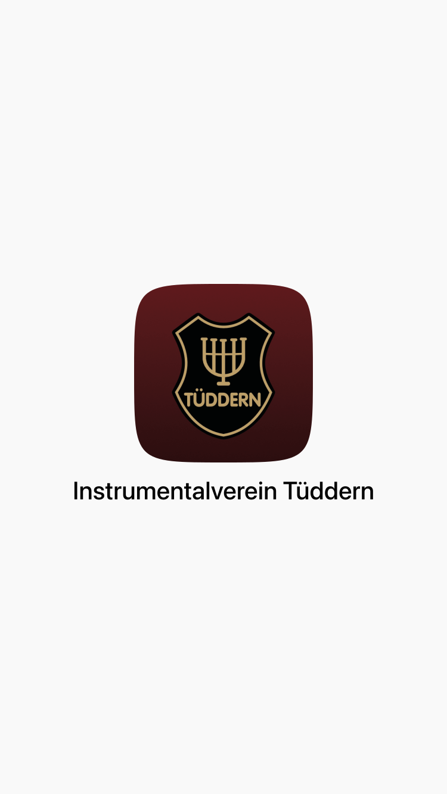

# create-launch-images

> Create Android-like launch images for iOS PWA’s based on a Web App Manifest.


[](https://github.com/sindresorhus/xo)
[](https://github.com/Dreamseer/create-launch-images/blob/master/LICENSE.md)

## Usage

```bash
$ npx create-launch-images --help

  Create Android-like launch images for iOS PWA’s based on a Web App Manifest.

  Usage
    $ npx create-launch-images <manifest-url>

  Options
    --outputDir, -o    Output directory
    --addRadius, -r    Add a radius to the app icon (prefers maskable icons)
    --font, -f         Text font family

  Example
    $ npx create-launch-images https://airhorner.com/manifest.json
```

## Optional installation

Using [npm](https://www.npmjs.com/get-npm):

```bash
$ npm install create-launch-images --global
```

Using [yarn](https://yarnpkg.com/):

```bash
$ yarn global add create-launch-images
```

## FAQ

### “How can I achieve the best results?”

* Add icons with [`purpose: 'maskable'`](https://web.dev/maskable-icon/) to your manifest and apply the `--addRadius` flag.
* Install [SF Pro Display](https://developer.apple.com/fonts/) locally for a font matching with the system UI.

### “Which properties of my Web App Manifest are parsed?”

1. The `name` property is used for the app name.
2. The `icons` property is used for the app icon. The largest square PNG icon will be used. If the `addRadius` flag is set, the largest icon with a `purpose` property of `maskable` will be used.
3. The `background_color` property is used for the image’s background color. Falls back to `white`.
4. The `orientation` property is used for the output formats (portrait, landscape or both).

## Examples

  

## License

MIT © [Marc Görtz](https://marcgoertz.de/)
